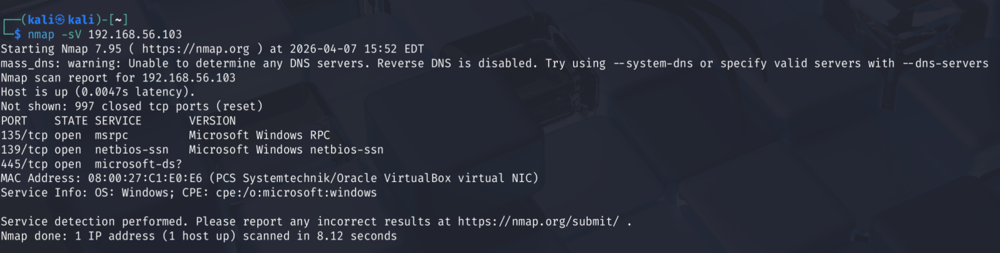
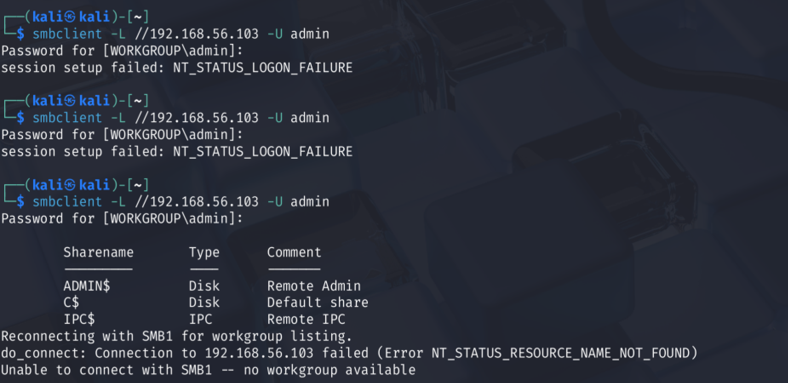
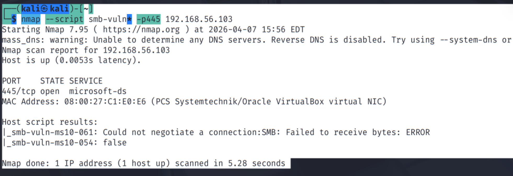
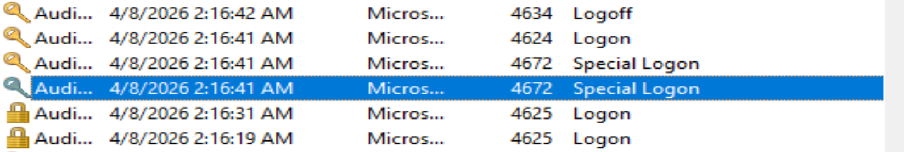

# 🔥 SOC Attack & Defense Lab (SMB-Based)

## 📌 Overview

This project demonstrates a real-world cybersecurity lab where I performed both **attacker (Red Team)** and **defender (Blue Team)** activities.

* Attacker: Kali Linux
* Victim: Windows 10
* Attack Type: SMB Enumeration & Authentication Attempts
* Detection: Windows Event Logs

---

## 🎯 Objective

To simulate attack scenarios and detect suspicious activities using log analysis, replicating a real SOC (Security Operations Center) workflow.

---

## ⚙️ Lab Setup

| Machine    | Role     |
| ---------- | -------- |
| Kali Linux | Attacker |
| Windows 10 | Victim   |

Network:

* Host-only network (192.168.56.x)

Example:

* Kali IP: 192.168.56.101
* Windows IP: 192.168.56.103

---

## 🔴 Attack Phase

### 🔹 1. Port Scanning (Reconnaissance)

```bash
nmap -sV 192.168.56.103
```

### ✅ Findings:

* Port 135 → RPC
* Port 139 → NetBIOS
* Port 445 → SMB (Main target)

👉 Identified SMB service as potential attack surface.

---

### 🔹 2. SMB Enumeration

```bash
nmap --script smb-enum-shares -p445 192.168.56.103
```

### ✅ Observation:

* No anonymous shares available
* SMB access is restricted

👉 Indicates system is hardened against unauthenticated access.

---

### 🔹 3. SMB Vulnerability Check

```bash
nmap --script smb-vuln* -p445 192.168.56.103
```

### ✅ Observation:

* No major vulnerabilities detected
* Target is not easily exploitable

👉 Shifted strategy to authentication-based attack.

---

### 🔹 4. SMB Authentication Attack (Brute-force Simulation)

```bash
smbclient -L //192.168.56.103 -U admin
```

### 🔥 Actions:

* Performed multiple failed login attempts using incorrect passwords
* Attempted valid credentials to simulate successful login

👉 This simulates real-world brute force / credential attack behavior.

---

## 🔵 Defense Phase

### 📊 Log Analysis using Windows Event Viewer

Path:

```
Event Viewer → Windows Logs → Security
```

---

### 🔍 Key Event IDs Observed:

| Event ID | Description                               |
| -------- | ----------------------------------------- |
| 4625     | Failed login attempt                      |
| 4624     | Successful login                          |
| 4672     | Special privileges assigned (Admin login) |

---

### 🔎 Detection Insights:

* Multiple **4625 events** indicate brute-force attack attempts
* **4624 event** confirms successful authentication
* **4672 event** shows privileged (admin-level) access

👉 Source IP identified as attacker machine (Kali Linux)

---

## 📸 Screenshots

### 🔴 Port Scanning (Nmap)


👉 Shows open SMB port (445) along with RPC and NetBIOS services.

---

### 🔴 SMB Enumeration


👉 No anonymous shares found, indicating restricted access.

---

### 🔴 SMB Vulnerability Scan


👉 No critical vulnerabilities detected on SMB service.

---

### 🔴 SMB Authentication Attack


👉 Multiple failed login attempts followed by access attempt to SMB shares.

---

### 🔵 Log Detection (Event Viewer)


👉 Logs clearly show failed (4625), successful (4624), and privileged (4672) logins.


## 🧠 Key Learnings

* Performed network reconnaissance using Nmap
* Identified SMB as an attack surface
* Conducted authentication-based attack simulation
* Analyzed Windows security logs for detection
* Understood real SOC workflow (Attack → Detection → Analysis)

---

## 🚀 Conclusion

This project demonstrates a complete SOC workflow by simulating an attack on a Windows system and detecting it through log analysis. It highlights practical skills in network scanning, attack simulation, and security monitoring.

---

